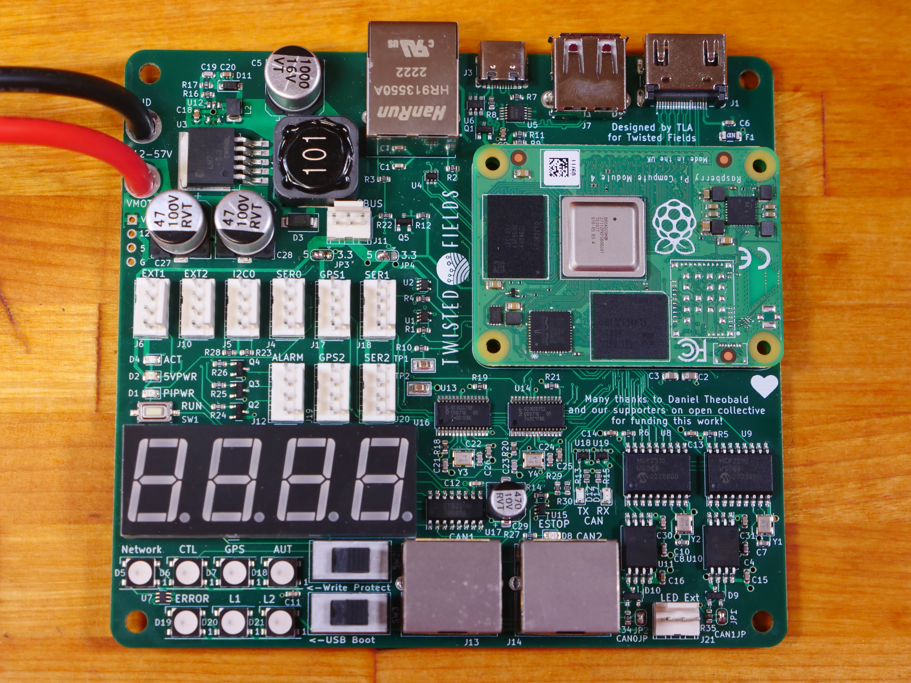

# Acorn Robot Electronics

### About

PCBs designed in Kicad for Acorn the farming robot.

Our dream is that you will fab your own boards, make changes, and share your work - giving this design life beyond our efforts.

Designed by Taylor Alexander for Twisted Fields, for the Acorn Precision Farming Rover.

Many thanks to [Daniel Theobald](https://www.twistedfields.com/blog). Without your financial support and encouragement this project would not have been possible.

Thanks to all of our supporters on Open Collective. Your contributions are helping grow this project in to a sustainable open source organization.

You can support this project yourself at our [Open Collective Page](https://opencollective.com/twisted-fields-research-collective).

To learn more about Acorn, please see our [announcement blog post](https://community.twistedfields.com/t/introducing-acorn-a-precision-farming-rover-from-twisted-fields/).
Or see a more recent [technical update here](https://community.twistedfields.com/t/march-2022-update-simulation-brakes-funding-and-navigation-improvements/202).

