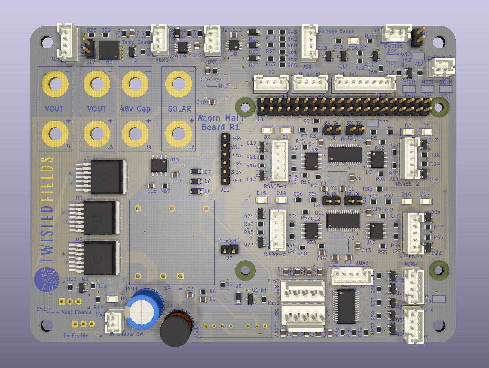

% Acorn Raspberry Pi Motherboard

## About

This is the motherboard design used on Acorn, the precision farming rover
from Twisted Fields.

This board provides motor control communication to four Odrive motor controllers
via RS-485, e-stop control, motor power control, and more.

For more information please see http://community.twistedfields.com

Tin Woodman board artwork originally by William Wallace Denslow (1856-1915)
https://en.wikipedia.org/wiki/Tin_Woodman

Kicad project derived from:
https://github.com/xesscorp/RPi_Hat_Template